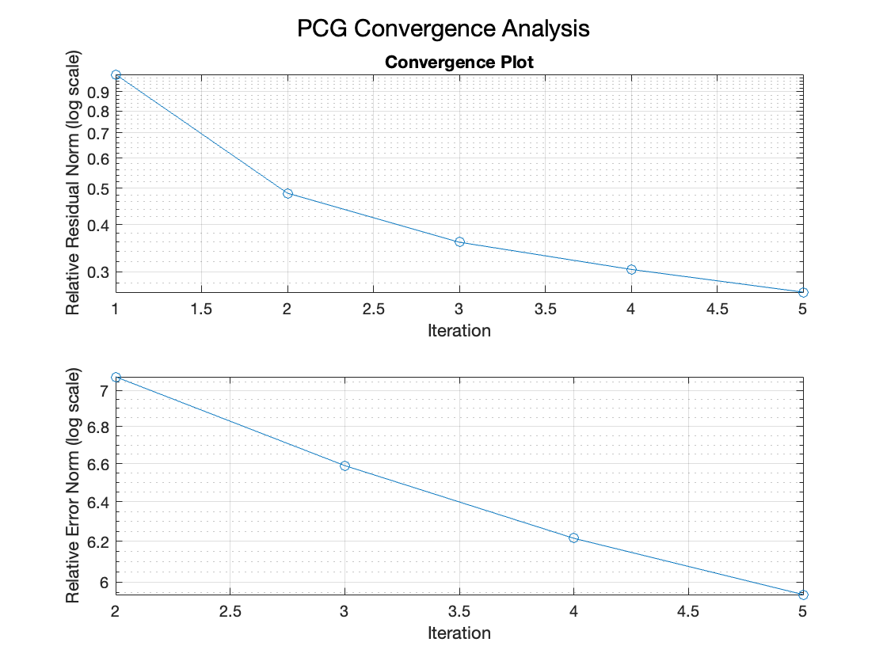

# Numerical-Methods
This repository contains MATLAB implementations for the Scientific Computing Lab (2023-24) course. It includes solutions to four key problems:

1. **Matrix Cholesky Decomposition Timing Analysis** `(chol_timing.m)`:
   - Measures execution time of `chol(A)` for random SPD matrices.
   - Fits cubic, quadratic, and quartic polynomials to model complexity.

2. **Tridiagonal System Solver** `(tridiagonal_solver.m)`:
   - Implements vectorized and non-vectorized solvers for tridiagonal systems.
   - Tests diagonal dominance and norm behavior.
  
3. **Tensor Operations (TTV/TTM/TTT)** `(tensor_operations.m)`:
   - Custom implementations of tensor-vector/matrix products and outer/inner products.
   - Validated against Tensor Toolbox functions.
  
4. **Preconditioned Conjugate Gradient (PCG) Method** `(pcg_solver.m)`:
   - Modified PCG solver with error tracking for Poisson and sparse matrix systems.
   - Includes ILU/IC preconditioning and convergence plots.
   - Some **key results** are the following:
     - The matrix used is (1138_bus)[https://sparse.tamu.edu/HB/1138_bus]

      | Preconditioning    | Iterations | Residual Norm | Error Norm (A-norm) |
      | ------------------ | ---------- | ------------- | ------------------- |
      | None               | 4          | Slow decay    | High stagnation     |
      | ILU                | 4          | Fast decay    | 10× lower error     |

     - Plot without preconditioning `pois_no_pre_4.png`
     - 
       


### File Structure

```bash
├── Documentation/
    ├── Documentation.pdf  # Doc in Greek
├── chol_timing.m          # Problem 1: Cholesky timing and polynomial fitting  
├── tridiagonal_solver.m   # Problem 2: Tridiagonal system solver  
├── tensor_operations.m    # Problem 3: Tensor operations (TTV/TTM/TTT)  
├── pcg_solver.m           # Problem 4: PCG with error tracking  
├── README.md              # Repository overview  
```
